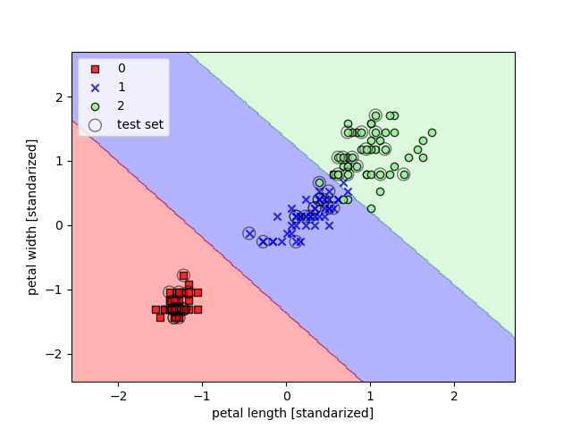

# Aprendizaje computacional

En este repositorio se recogen ejemplos prácticos de aprendizaje computacional realizados
siguiendo la lectura del libro `Python Machine Learning` de Sebastian Raschka y Vahid Mirjalili.

## Tipos de aprendizaje automático

### Aprendizaje supervisado

- **Objetivo** - Aprender un modelo a partir de datos de entrenamiento etiquetados, que permite hacer predicciones de
futuro.

- **Ejemplos** - Filtro de correo no deseado. Este es un ejemplo de **tarea de clasificación** con asignación
de etiquetas. Otro ejemplo podría ser de este tipo de aprendizaje la **regresión**, donde el valor predicho puede ser un
valor continuo.

### Aprendizaje reforzado

- **Objetivo** - Desarrollar un agente que mejore su rendimiento basado en interacciones con el entorno. En este caso,
durante el periodo de aprendizaje los resultados no se contrastan con la etiqueta o el valor correcto de los datos de
entrada, sino con una **función de recompensa**.

- **Ejemplos** - Motor de ajedrez, donde el agente elige entre una serie de movimientos y la recompensa se puede definir
como la victoria o la derrota al final del juego.

### Aprendizaje no supervisado

- **Objetivo** - Explorar la estructura de un conjunto de datos de entrada sin etiquetar para extraer información
significativa de ellos.

- **Ejemplos** - Descubrir grupos de clientes basados en sus intereses con el fin de desarrollar estrategias de
marketing.

## Algoritmos simples de aprendizaje automático

### Algunos algoritmos básicos

#### Perceptrón

Algoritmo capaz de optimizar un conjunto de **coeficientes de peso** en base a los cuales realizar predicciones.

Durante la fase de entrenamiento se utilizan un conjunto de datos de entrada etiquetados. En una serie de iteracioneso o 
**épocas** realizadas sobre ellos, llamadas **entrenamiento**, el algoritmo es capaz de optimizar los pesos.

Esta optimización se realiza obteniendo el producto de los pesos con los valores de entrada, el cual se contrasta 
con una función escalón en base a la etiqueta de los valores de entrada.

La **convergencia** sólo está garantizada si las clases son linealmente separables y el rango de aprendizaje es 
suficientemente pequeño.

#### Neuronas lineales adaptativas (Adaline)

La diferencia con respecto al perceptrón reside en que los pesos se actualizan en base a una **función de activación 
lineal** (o **función objetivo** o **función de coste**), en lugar de hacerlo en base a una función escalón unitario. 
Minificar el coste de esta función lineal permitirá desarrollar algoritmos más avanzados.

Algunas de las estrategias para disminuir este coste son:

- **Optimizar el rango de aprendizaje** - Experimentación con distintos rangos de aprendizaje en contraste con la
convergencia y el número de errores obtenido.

- **Descenso de gradiente** - Algoritmo de aproximación mediante sucesivas iteraciones.

- **Descenso de gradiente estocástico** - Similar al descenso de gradiente, sin embargo la actualización de pesos se
realiza de forma incremental para cada muestra de entrenamiento.

- **Escalado de características** - Tratamiento de los datos de entrada que favorece la convergencia.

#### Regresión logística

A pesar de su nombre, se trata de un modelo para clasificación, similar a los anteriores modelos.

Es muy similar al modelo Adaline, sin embargo en lugar de utilizar una función de activación lineal para la optimización
de pesos, se utiliza una función sigmoide, que se interpreta como la probabilidad de que una muestra pertenezca a una
etiqueta determinada.

Una de las ventajas de este modelo es que no sólo es capaz de **predecir la etiqueta** de la muestra, **también la
probabilidad** de que ésto ocurra. Por este motivo es un módelo popular para predicciones metereológicas o cálculo de
probabilidades de que un paciente padezca una enfermedad concreta en función a determinados síntomas.

#### Máquina de vectores de soporte

Puede considerarse como una extensión del Perceptrón. Mientras que el objetivo del Perceptrón es minimizar los errores
de clasificación, el objetivo de optimización de este modelo es maximizar el margen o distancia de los límites de 
decisión.

La ventaja de ampliar este margen es que estos modelos tienden a tener un error más bajo en la generalización, allí
donde los modelos con márgenes más estrechos son más propensos al sobreajuste (éstos conceptos se desarrollan en el 
siguiente apartado), como se puede ver en el siguiente ejemplo:

Otro motivo para su utilización es que puede ser fácilmente kernelizada para resolver problemas de clasificación no 
lineal, como se puede ver en el siguiente ejemplo:

#### Árboles de decisión

Utilizando el algoritmo de decisión, empezamos por la raíz y dividimos los datos en la característica que resulta en la
mayor **ganancia de información** o **IG**.

En un proceso iterativo, repetimos este procedimiento de división en cada nodo hijo hasta que las hojas sean puras. Esto
producirá un árbol muy profundo que puede provocar sobreajuste, por lo que una buena opción es podar el árbol
ajustándolo a una profundidad máxima. 

Las medidas de impurezas o criterios de división que normalmente se utilizan en árboles de decisión binarios son:

- Impureza de Gini
- Entropía
- Error de clasificación

#### Combinar árboles de decisión mediante bosques aleatorios

Un bosque aleatorio se puede considerar como un conjunto de árboles de decisión. La idea es promediar la decisión de 
múltiples árboles que individualmente sufren una elevada varianza, para crear un modelo más robusto.

A partir de una muestra aleatoria de tamaño **n** se crea un árbol de decisión, y así sucesivamente hasta llegar al 
número total de árboles que componen el bosque. Al tratarse de una muestra aleatoria, existirá una gran diversidad entre
los árboles que componen el bosque, y la clasificación se realizará por **mayoría de votos**.

El único parámetro que debemos tener en cuenta para solucionar problemas de ajuste es el número de árboles. Cuanto más
alto es éste número, el rendimiento será mejor a expensas de un mayor coste computacional. En menor medida, otros 
parámetros a tener en cuenta son el tamaño de la muestra y el número de características a tener en cuenta para cada 
división.

#### K-vecinos más cercanos

Se trata de un algoritmo vago, ya que en lugar de obtener una función discriminativa, memoriza el conjunto de datos de
entrenamiento.

Su estrategia es elegir una muestra y una distancia, encontrar los k-vecinos más cercanos dentro de esa distancia y 
asignar una etiqueta a la muestra por mayoría de votos en base a la clasificación de sus vecinos.

La principal ventaja es que carece de coste de entrenamiento y se adapta inmediatamente cuando se recogen nuevos datos 
de entrenamiento. Sin embargo, el coste computacional crece linealmente con las nuevas muestras y el espacio de 
almacenamiento puede llegar a ser un problema.

La elección del número de vecinos y de la distancia para obtenerlos será crucial encontrando un buen equilibrio entre el
sobreajuste y el subajuste.

### Modelos paramétricos frente a no paramétricos

En los **modelos paramétricos**, a partir de un conjunto de datos de entrenamiento obtenemos una función que pueda 
clasificar nuevos datos sin necesidad del conjunto de datos de entrenamiento original. Algunos ejemplos son:

- Perceptrón
- Regresión logística
- Máquina de vectores de soporte (SVM)

Contrariamente, en los **modelos no paramétricos** el número de parámetros crece con los datos de entrenamiento, como se
puede ver en:

- Árboles de decisión
- Bosques aleatorios
- SVM kernelizada
- K-vecinos más cercanos

## Problemas de ajuste y estrategias

### Sobreajuste y regularización

El sobreajuste es un problema común en el que un algoritmo funciona bien durante el entrenamiento pero no generaliza 
correctamente con los datos de prueba. En este caso se dice que el modelo tiene una **alta varianza**, causada 
generalmente por un modelo demasiado complejo.

De forma parecida, un modelo puede no ser lo suficientemente complejo para capturar correctamente el patrón en los datos
de entrenamiento, provocando una situación de **subajuste o underfitting**.

Estos problemas se dan en modelos de decisión no lineales, y una estrategia de compensación es la denominada
**regularización**.

### Kernelización

Al enfrentarse a un problema no lineal, una de las estrategias para encontrar un modelo que se ajuste adecuadamente es
proyectar las características originales hacia un espacio de dimensiones mayores.

Un ejemplo es transformar un conjunto de datos bidimensionales en un nuevo conjunto de características tridimensionales
y encontrar un hiperplano lineal que se convierta en un límite de decisión, para volver a proyectar las características
en el espacio original. 

A continuación se muestran dos ejemplos de kernelización para resolver el clásico problema de clasificación de flores 
`Iris`, en el primero, el parámetro **gamma** o parámetro de **corte** para la esfera Gaussiana tiene un valor bajo, lo
que genera un modelo de límites más suaves:

En el segundo ejemplo, este valor es más elevado, con lo que los límites son más ajustados:

## Preprocesamiento de datos

La cantidad y calidad de los datos con los que se entrena un algoritmo determinan lo bien que puede aprender. A 
continuación se describen una serie de técnicas básicas para potenciar estas cualidades en la información manejada.

### Tratar con datos ausentes

Algunas muestras pueden carecer de uno o más valores, lo que puede provocar que el algoritmo no pueda manejar estas 
muestras o bien genere resultados impredecibles. Las opciones para solventar este problema son:

- **Eliminar muestras incompletas** - Este enfoque permitirá unos resultados previsibles, sin embargo eliminar 
demasiadas muestras puede conllevar a resultados poco fiables o a la incapacidad para realizar una buna discriminación
entre clases.

- **Imputar valores ausentes** - Se utilizan distintas técnicas de interpolación (como la media o el valor más 
frecuente de una característica concreta) para asignar un valor.

### Trabajar con datos categóricos

Tanto las características nominales (valores no numéricos sin relación de orden entre ellos) como las ordinales (valores
no numéricos con una relación de orden entre ellos) se deberán transformar en valores enteros para poder ser procesados 
por el algoritmo.

En caso de las características nominales, una simple asignación de números enteros aleatorios a cada uno de los posibles
valores podría producir resultados poco óptimos si el algoritmo interpreta que existe una relación de orden entre ellos.

Una solución a este problema es la **codificación en caliente**, que crea una nueva característica ficticia  para cada
valor único en la columna de características nominales.

### Crear un conjunto de datos de entrenamiento y de prueba

Por lo general no es interesante colocar demasiados datos en el conjunto de prueba, sin embargo, cuanto menos sea el
tamaño de este conjunto, menos precisa será la estimación del error de generalización.

Las proporciones que se utilizan con más frecuencia se encuentran dentro del rango 60:40-80:20, sin embargo para grandes
conjuntos de datos el rango 90:10-99:1 podría ser adecuado.

Es habitual entrenar al algoritmo con los datos de prueba una vez realizada la primera estimación para mejorar el
rendimiento. Sin embargo, si el modelo es demasiado pequeño este rendimiento puede verse devaluado. Otro de los
inconvenientes es que sin datos de prueba no se puede evaluar el modelo predictivo final.

### Ajustar las características a la misma escala

Los árboles de decisión y los bosques aleatorios son dos de los pocos algormitmos que no se ven afectados por la escala
de las características. Sin embargo, la mayoría de ellos tenderán a ajustar sus pesos en torno a aquella característica
que se encuentra en una escala mayor, ignorando el resto de características.

Los dos enfoques más importantes en el ajuste de escalas son:

- **Normalización min-max** - Reescalado de características en un rango de [0, 1], útil cuando se necesitan valores en
un intervalo limitado.

- **Estandarización** - Centra las características en torno a una media con una desviación estándar de 1, indicado para
algoritmos con descenso de gradiente o para aquellos que inicialicen sus pesos a valores cercanos a 0, como la regresión
logística y las SVM.

La tabla siguiente muestra la diferencia entre las dos técnicas de escalado:

| Entrada | Estanzarizada | Normalizada min-max |
|---------|---------------|---------------------|
| 0.0     | -1,46385      | 0.0                 |
| 1.0     | -0,87831      | 0.2                 |
| 2.0     | -0,29277      | 0.4                 |
| 3.0     | 0,29277       | 0.6                 |
| 4.0     | 0,87831       | 0.8                 |
| 5.0     | 1,46385       | 1.0                 |

### Seleccionar características significativas

Cuando un modelo indica problemas de sobreajuste, las soluciones más frecuentes para reducir el error de la 
generalización son las siguientes:

- Recoger más datos de entrenamiento.
- Introducir una penalización para la complejidad mediante la regularización.
- Elegir un modelo más sencillo con menos parámetros.
- Reducir la dimensionalidad de los datos.

La **regularización** da como resultado unos valores menos extremos, mientras que con la **reducción de 
dimensionalidad** se modificarán las características dando como resultado modelos menos complejos, lo que es
especiamente útil en algoritmos que no aceptan regularización.

Dentro de la reducción de dimensionalidad existen dos técnicas muy diferentes. Una es la **selección de
características**, que elimina características en función de su relevancia, y otra es la **extracción de
características**, que comprime las características en lugar de eliminarlas.

Estas soluciones no sólo son aplicables a problemas de sobreajuste, también sirven para reducir la complejidad
computacional durante el entrenamiento o minimizar los costes de recopilación de datos en caso de ser requerido.

Un ejemplo de reducción de dimensionalidad es el proceso de selección de características llamado **SBS** o **selección
secuencial hacia atrás**. Este algoritmo elimina secuencialmente cada una de las características y compara los
resultados para determinar cuales de ellas son irrelevantes.

Otro ejemplo es el uso de bosques aleatorios para determinar las características más relevantes en la generalización
de un modelo predictivo y en qué porcentaje afectan a los resultados. Así, en el conjunto de datos `Wine`, podemos
obtener los siguientes resultados:

## Reducción de dimensionalidad

A continuación se verán las tres técnicas fundamentales en la **extracción de características**, que permitirán resumir
el contenido informativo de un conjunto de datos en otro de menor dimensión.

Al igual que en la **selección de características**, estas técnicas serán útiles en la optimización del coste de
almacenaje y del coste computacional de datos, además de mejorar el rendimiento productivo del algoritmo.

Además, estas técnicas son especialmente idóneas trabajando con modelos sin regularizar.

### Análisis de componentes principales (ACP)

Encuentra las direcciones de varianza máxima en datos de alta dimensión y las proyecta en un nuevo subespacio con 
dimensiones menores o iguales al original.